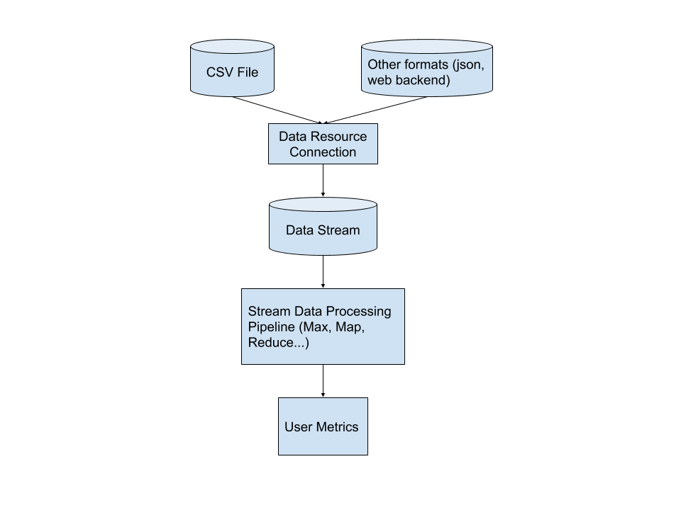

# Brainstorming and Design

Looks like a straight forward data processing problem. I would break the problem down into three parts

1. Use processing pipeline (here simply **min()**) to process the row/list based data and compute the desired metrics
2. Define a plain data objects, which stores the relevant information
3. Use a CSV data reader to create a `List` of data objects.

## Design Overview

## Design decisions:

- Use **Streams** over: Functional programming, which makes the data processing code very flexible and easy to comprehend.
- Use **OpenCSV**: Simple, lightweight and does the job (also some bean connections).

## Problems that can occur:

Most problems that can occur are related to the data IO. So reading the data and getting the data into the data objects.

- Problems reading the file (can be handled by OpenCSV)
- Invalid format/corrupted data (can be handled with OpenCSV)
- Format changes... (should be avoided, but only affects the code that connects the data resource with the data object)
- Not logical data. E.g. max. temperature < min. temperature. Since this would result in negative values this tamper with the result.